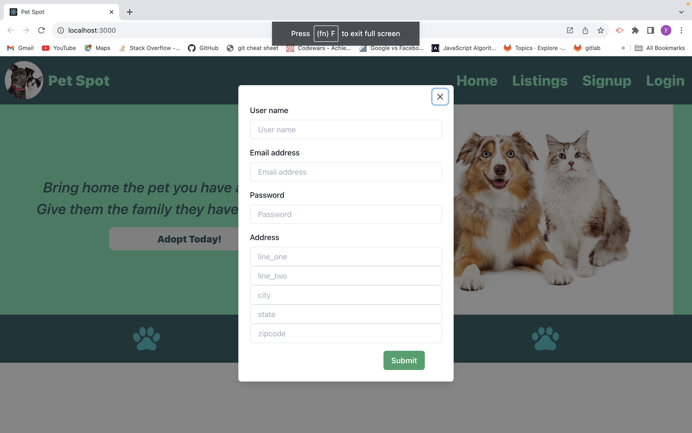
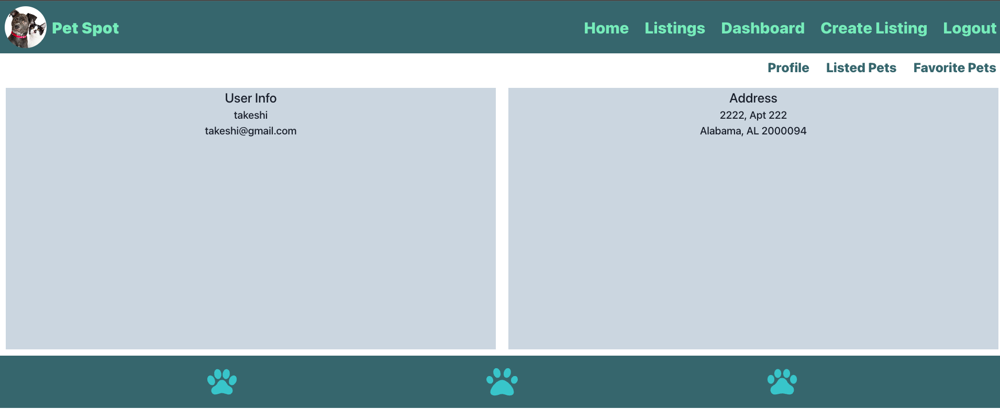
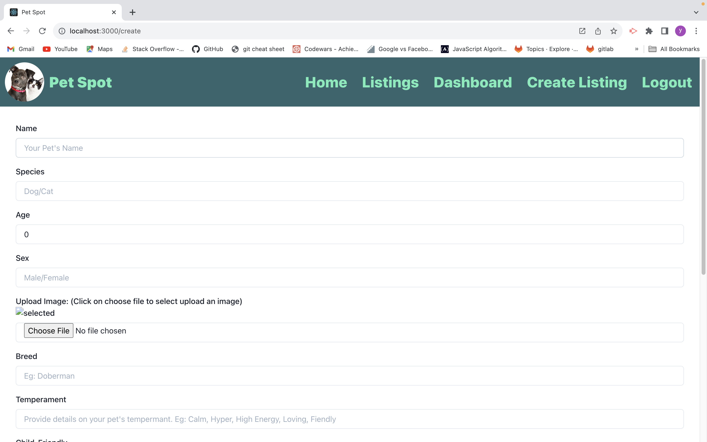
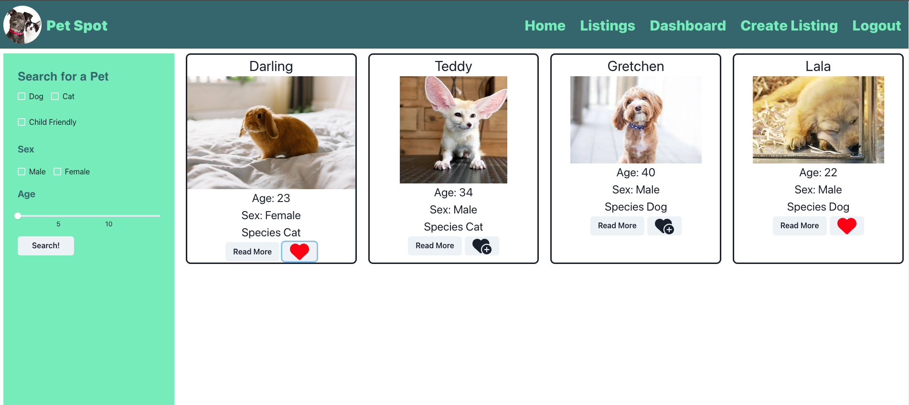

# Pet Spot
  

## Description
Pet Spot is a platform where users can easily search for pets to adopt and/or list pets for adoption. Sign up and search for pets [here](https://shielded-beach-29867-5efce834725b.herokuapp.com/)!

  ## Table of Contents

  - [Installation](#installation)
  - [Usage](#usage)
  - [Contribution](#contribution)
  - [Deployment](#deployment)
  - [display](#display)
  - [Technologies](#technologies)
  - [Testing](#testing)
  - [License](#license)
  - [Questions](#questions)
  - [View-Our-Projects](#projects)

  ## Installation

  Please clone the repository on your local machine and run `npm install` then `npm run develop`.

  ## Usage

  Run the application on your local machine then run it on your default browser. 
  
  ## Contribution 
    
        * Angelin Rajan
        * Lucas Young
        * Youssef Karoui
        * Edward Chang
        * Ziad Alfadl
  
  ## Deployment

  [Here's a link to heroku deployment](https://shielded-beach-29867-5efce834725b.herokuapp.com/)

  ## Display

 ### Signup Page
   
   

 ### Dashboard - Access your information, and owned & followed pet information
  
  

 ### Create Listing - Add a pet for adoption

  

### Listings - Search for pets, follow them and read their information
  

  ## Technologies

        * HTML5
        * CSS
        * JavaScript
        * REACT
        * Mongodb
        * Mongoose
        * Chakra UI
        * Express
        * Graphgl
        * Apollo-express
        * Bcrypt
        * Jsonwebtoken

  ## Testing 

  Run the application on your local machine and navigate through all pages of the app to checkout the functionality  on the application.

  ## License 

     Copyright 2023 Youssef Karoui    Permission is hereby granted, free of charge, to any person obtaining a copy of this software and associated documentation files (the “Software”), to deal in the Software without restriction, including without limitation the rights to use, copy, modify, merge, publish, distribute, sublicense, and/or sell copies of the Software, and to permit persons to whom the Software is furnished to do so, subject to the following conditions: The above copyright notice and this permission notice shall be included in all copies or substantial portions of the Software.

  If you would like to know more about licensing information here's a link for more details: https://opensource.org/license/mit/

  ## Questions 

  [Email us if you have any questions](mailto:youssefkaroui6@gmail.com;uwlryroung@gmail.com;ziad.t.alfadl@gmail.com;boyofpopsicle@gmail.com;angelinrajan20@gmail.com)

## View Our Projects on Github
 
 * [Ziad's](https://github.com/Z-Alfadl?tab=repositories)
 * [Youssef's](https://github.com/youssefkaroui?tab=repositories)
 * [Angelin's](https://github.com/angelinrajan?tab=repositories)
 * [Edward's](https://github.com/ednihilator?tab=repositories)
 * [Lucas's](https://github.com/uwlryoung?tab=repositories)

  